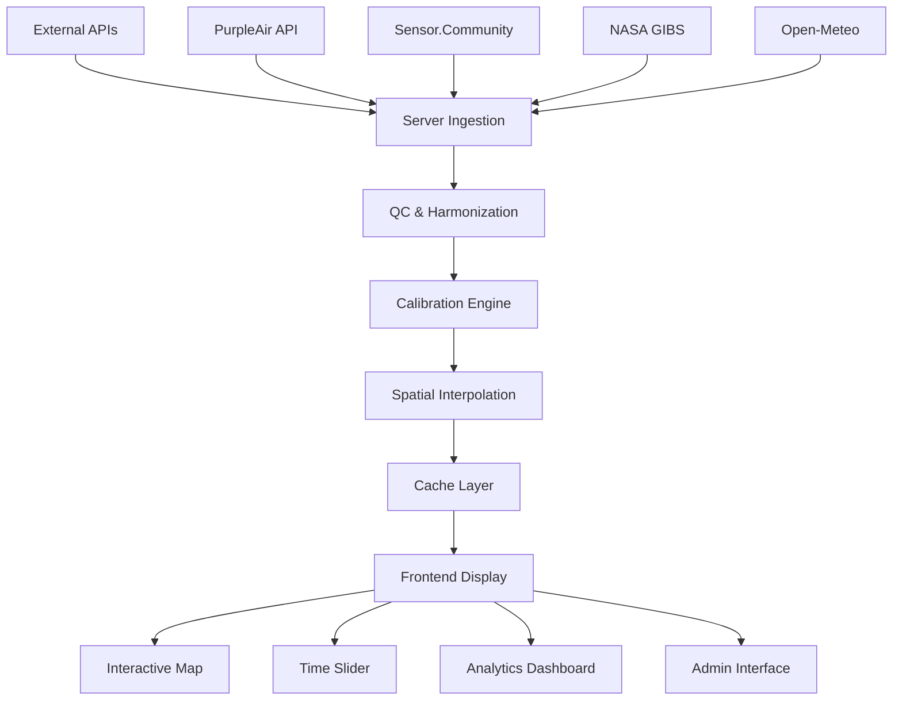
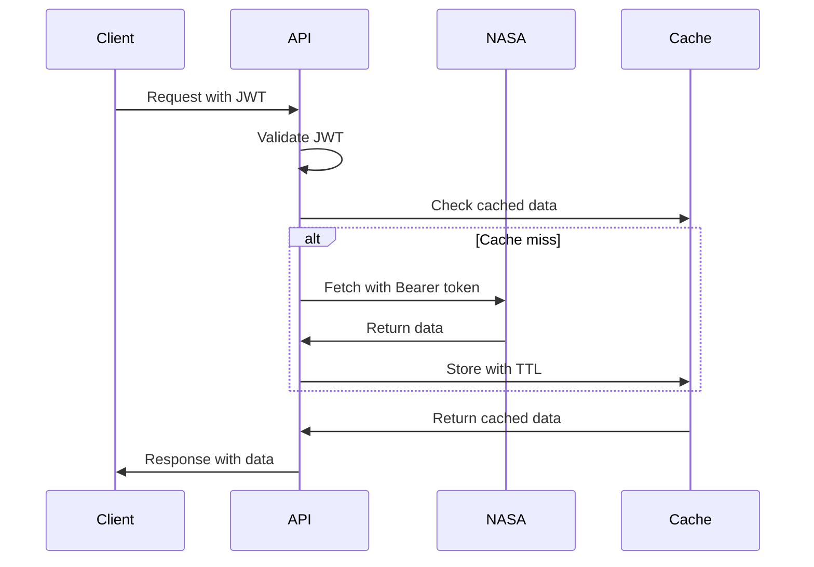

# 🏗️ SEIT Architecture Documentation

## 🎯 System Overview

SEIT is a production-grade environmental monitoring platform that combines real-time sensor data, NASA satellite imagery, and advanced analytics to provide comprehensive air quality insights.

## 🛠️ Technology Stack

### Frontend Architecture
```
React 18 + TypeScript
├── Vite (Build Tool & Dev Server)
├── Tailwind CSS + Relume Components (Styling)
├── React Router (Navigation)
├── Zustand (State Management)
├── Leaflet + MapboxGL (Interactive Mapping)
├── Recharts (Data Visualization)
└── Lucide React (Icon System)
```

### Backend Architecture
```
FastAPI + Python 3.11
├── SQLAlchemy + Alembic (Database ORM & Migrations)
├── Pandas + NumPy (Data Processing)
├── Scikit-learn (Machine Learning)
├── Celery + Redis (Background Jobs)
├── Uvicorn (ASGI Server)
└── Pydantic (Data Validation)
```

### Infrastructure
```
Docker + Docker Compose
├── Nginx (Reverse Proxy & Static Files)
├── PostgreSQL (Production Database)
├── Redis (Caching & Job Queues)
└── GitHub Actions (CI/CD Pipeline)
```

## 📊 Data Flow Architecture

### High-Level Data Flow


### Data Processing Pipeline
1. **Ingestion**: Server-side fetching from external APIs
2. **Harmonization**: Canonical field mapping and validation
3. **Quality Control**: Range checks, spike detection, meteorological flagging
4. **Calibration**: Linear models with uncertainty quantification
5. **Interpolation**: IDW and kriging for spatial prediction
6. **Caching**: Multi-level cache with TTL management
7. **Delivery**: API endpoints with vector tiles and GeoJSON

## 🗃️ Database Schema

### Core Tables
```sql
-- Harmonized sensor data
sensors_harmonized (
    id, sensor_id, sensor_type, lat, lon, 
    timestamp_utc, raw_pm2_5, rh, temperature,
    source, raw_blob, qc_flags, created_at
)

-- Calibration parameters
sensor_calibration (
    sensor_id, sensor_type, alpha, beta, gamma, delta,
    sigma_i, last_calibrated, calibration_r2, created_at
)

-- Processed grid cache
artifact_cache (
    cache_key, bbox, timestamp_utc, resolution,
    method, grid_data, metadata, expires_at, created_at
)

-- Analysis results
analysis_jobs (
    job_id, job_type, status, parameters,
    result_path, error_message, created_at, completed_at
)
```

### Relationships
- One-to-many: `sensor_id` → `sensors_harmonized` records
- One-to-one: `sensor_id` → `sensor_calibration` parameters
- Many-to-many: Analysis jobs ↔ Grid artifacts

## 🌐 API Architecture

### RESTful Endpoints
```
/api/sensors/
├── /multi-source/all           # Combined sensor data
├── /purpleair/sensors          # PurpleAir network
├── /sensor-community/sensors   # Sensor.Community data
├── /openaq/sensors            # OpenAQ measurements
└── /upload                    # Custom data upload

/api/heatmap/
├── /tiles                     # Vector/raster tiles
├── /grid                      # GeoJSON grid data
└── /methods                   # Available interpolation methods

/api/analytics/
├── /hotspots                  # DBSCAN clustering
├── /anomalies                 # ML anomaly detection
├── /trends                    # Temporal analysis
└── /summary                   # Statistics summary

/api/admin/
├── /status                    # System health
├── /calibration               # Sensor calibration
├── /nasa/validate-token       # NASA token validation
└── /cache/clear               # Cache management
```

### Authentication Flow


## 🔄 Background Processing

### Celery Task Architecture
```python
# Scheduled tasks
@celery.task
def fetch_sensor_data():
    """Hourly sensor data ingestion"""

@celery.task  
def calibrate_sensors():
    """Daily calibration updates"""

@celery.task
def generate_heatmap_snapshots():
    """Generate hourly PM2.5 grids"""

@celery.task
def run_validation():
    """Daily cross-validation"""
```

### Task Scheduling
- **Every 10 minutes**: Fetch real-time sensor data
- **Every hour**: Generate heatmap snapshots for major cities
- **Daily at 02:00 UTC**: Recalibrate sensors and run validation
- **Weekly**: Clean up old cache artifacts and analysis results

## ��️ Mapping Architecture

### Map Providers
- **Primary**: MapboxGL for vector maps and satellite imagery
- **Fallback**: Leaflet with OpenStreetMap tiles
- **Satellite**: NASA GIBS WMTS integration

### Layer Management
```javascript
// Layer hierarchy (top to bottom)
1. Sensor markers (highest priority)
2. Uncertainty overlay (semi-transparent)
3. PM2.5 heatmap (vector tiles)
4. NASA satellite layers (GIBS)
5. Base map (Mapbox/OSM)
```

### Marker System
- **Stable Rendering**: Canvas-based markers with fixed anchors
- **Color Coding**: WHO air quality index standards
- **Clustering**: Dynamic clustering for high-density areas
- **Popups**: Calibrated values with uncertainty estimates

## 🔬 Scientific Computing

### Spatial Interpolation
```python
# IDW (Inverse Distance Weighting)
c_hat = Σ(w_i * c_i) / Σ(w_i)
w_i = 1 / (d_i^p * σ_i^2)  # Distance and uncertainty weighting

# Universal Kriging
c_hat(x) = Σ(λ_i * c_i) + Σ(β_j * f_j(x))  # With external drift
Var[c_hat(x)] = σ² * [1 - Σ(λ_i) + μ^T * K^-1 * k]  # Kriging variance
```

### Calibration Models
```python
# Linear calibration with covariates
c_corrected = α + β * c_raw + γ * RH + δ * T

# Uncertainty propagation
σ_corrected = √(σ_calibration² + σ_sensor²)
```

### Quality Control Rules
1. **Range Validation**: 0 ≤ PM2.5 ≤ 500 μg/m³
2. **Spike Detection**: |Δc/Δt| > threshold
3. **Humidity Flagging**: RH > 85% (optical sensor uncertainty)
4. **Spatial Consistency**: Cross-validation with neighboring sensors

## 🚀 Deployment Architecture

### Development Environment
```
Developer Machine
├── Frontend (Vite Dev Server, Port 3000)
├── Backend (FastAPI, Port 8000)
├── Database (SQLite, Local File)
└── Cache (Optional Redis)
```

### Production Environment
```
Production Server/Cloud
├── Nginx (Reverse Proxy, SSL Termination)
├── Frontend Container (React Build)
├── Backend Container (FastAPI + Uvicorn)
├── PostgreSQL (Persistent Data)
├── Redis (Cache + Job Queue)
├── Celery Workers (Background Processing)
└── Monitoring (Health Checks, Metrics)
```

### Scaling Considerations
- **Horizontal Scaling**: Multiple backend containers behind load balancer
- **Database Scaling**: Read replicas for analytics queries
- **Cache Scaling**: Redis cluster for high-traffic scenarios
- **Processing Scaling**: Additional Celery workers for analysis jobs

## 🔐 Security Architecture

### Authentication & Authorization
- **JWT Tokens**: Stateless authentication for API access
- **Role-Based Access**: Admin vs. regular user permissions
- **API Key Management**: Secure storage and rotation procedures

### Data Security
- **Environment Variables**: All secrets stored as environment variables
- **Server-Side APIs**: External API calls made server-side only
- **Input Validation**: Comprehensive validation for all endpoints
- **SQL Injection Protection**: Parameterized queries via ORM

### Network Security
- **HTTPS Enforcement**: TLS encryption for all communications
- **CORS Configuration**: Proper cross-origin resource sharing
- **Rate Limiting**: API rate limiting to prevent abuse
- **Security Headers**: CSP, HSTS, and other security headers

## 📈 Performance Architecture

### Caching Strategy
```
L1: Redis (Hot data, 5-minute TTL)
L2: Application Memory (Frequently accessed, 1-hour TTL)
L3: Artifact Storage (Processed grids, 24-hour TTL)
L4: Database (Persistent storage)
```

### Optimization Techniques
- **Lazy Loading**: Components and routes loaded on demand
- **Code Splitting**: Separate bundles for different page sections
- **Image Optimization**: Responsive images with modern formats
- **Database Indexing**: Optimized queries for spatial and temporal data
- **Vector Tiles**: Efficient map data transmission
- **Asset Caching**: CDN-friendly static asset optimization

## 🔧 Development Architecture

### Component Organization
```
src/
├── components/           # Reusable UI components
│   ├── Map/             # Mapping components
│   ├── Dashboard/       # Analytics dashboard
│   ├── Feedback/        # Notifications and status
│   └── Layout/          # Navigation and layout
├── hooks/               # Custom React hooks
├── services/            # API clients and utilities
├── pages/               # Route components
└── utils/               # Helper functions
```

### Backend Organization
```
backend/
├── api/
│   ├── routes/          # API endpoint definitions
│   ├── services/        # Business logic services
│   ├── models/          # Database models
│   └── utils/           # Helper utilities
├── tests/               # Unit and integration tests
└── migrations/          # Database migrations
```

This architecture supports both rapid development and production scalability while maintaining scientific accuracy and data security standards.
